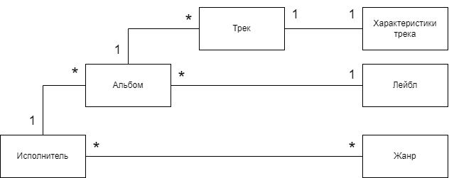

Демострационный пример проекта на Spring.

    
Описание предметной области

    <ul>
    

        
Исполнитель (Artist)

        <ul>
            <li>spotify uri</li>
            <li>name</li>
        </ul>
    

    

        
Трек (Track)

        <ul>
            <li>spotify uri</li>
            <li>name</li>
            <li>album_id</li>
            <li>disk number</li>
            <li>track number</li>
            <li>duration</li>
            <li>tempo</li>
        </ul>
    

    

        
Трек (Track)

        <ul>
            <li>spotify uri</li>
            <li>name</li>
            <li>album_id</li>
            <li>disk number</li>
            <li>track number</li>
            <li>duration</li>
            <li>tempo</li>
        </ul>
    

    

        
Характеристики трека (track properties)

        <ul>
            <li>danceability</li>
            <li>energy</li>
            <li>loudness</li>
            <li>mode</li>
            <li>speechiness</li>
            <li>acousticness</li>
            <li>instrumentalness</li>
            <li>liveness</li>
            <li>Valence</li>
        </ul>
    

    

        
Альбом (Album)

        <ul>
            <li>spotify uri</li>
            <li>name</li>
            <li>artist_id</li>
            <li>release date</li>
            <li>album image url</li>
        </ul>
    

    

        
Лейбл (Label)

        <ul>
            <li>name</li>
        </ul>
    

    

        
 Жанр (Genre)

        <ul>
            <li>name</li>
        </ul>
    

    </ul>
    

